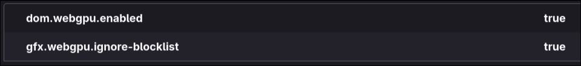
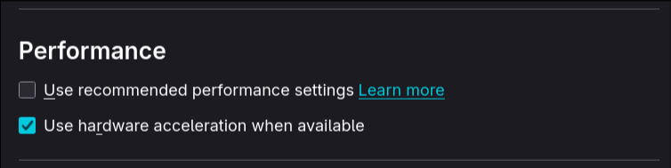
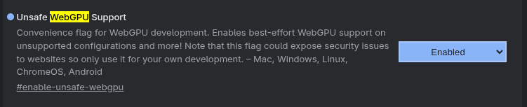

# VideoToAscii
An application to render a video to ascii art in real time.

The application is a web page written in rust and compiled in [web assembly](https://webassembly.org/), the video is processed using a compute shader with [wgpu](https://wgpu.rs/) entirely on the client side.

## Building
1. Add the wasm target
```bash
rustup target add wasm32-unknown-unknown
```
2. Build the project
```bash
cargo build --target wasm32-unknown-unknown
```
3. To deploy the app use a bundler like [trunk](https://trunk-rs.github.io/trunk/)
```bash
trunk serve
```

## Running
### Firefox
Firefox has disabled wgpu usage by default, to enable it go to `about:config` and enable both `dom.webgpu.enabled` and `gfx.webgpu.ignore-blocklist`

also go to `about:settings` and ensure hardware acceleration is enabled

### Chrome
Go to `chrome://flags` and enable `Unsafe WebGPU Support`
